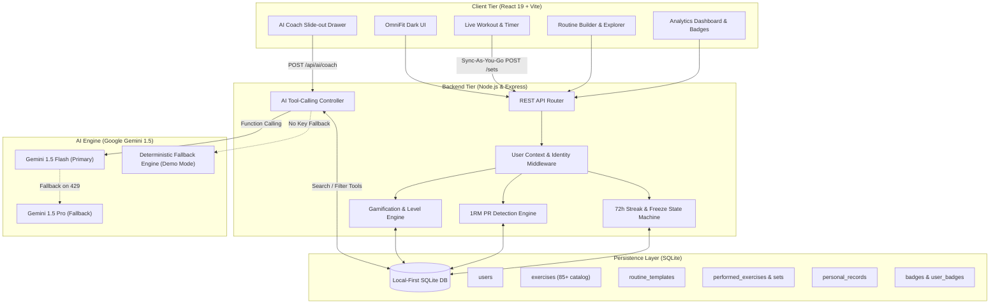
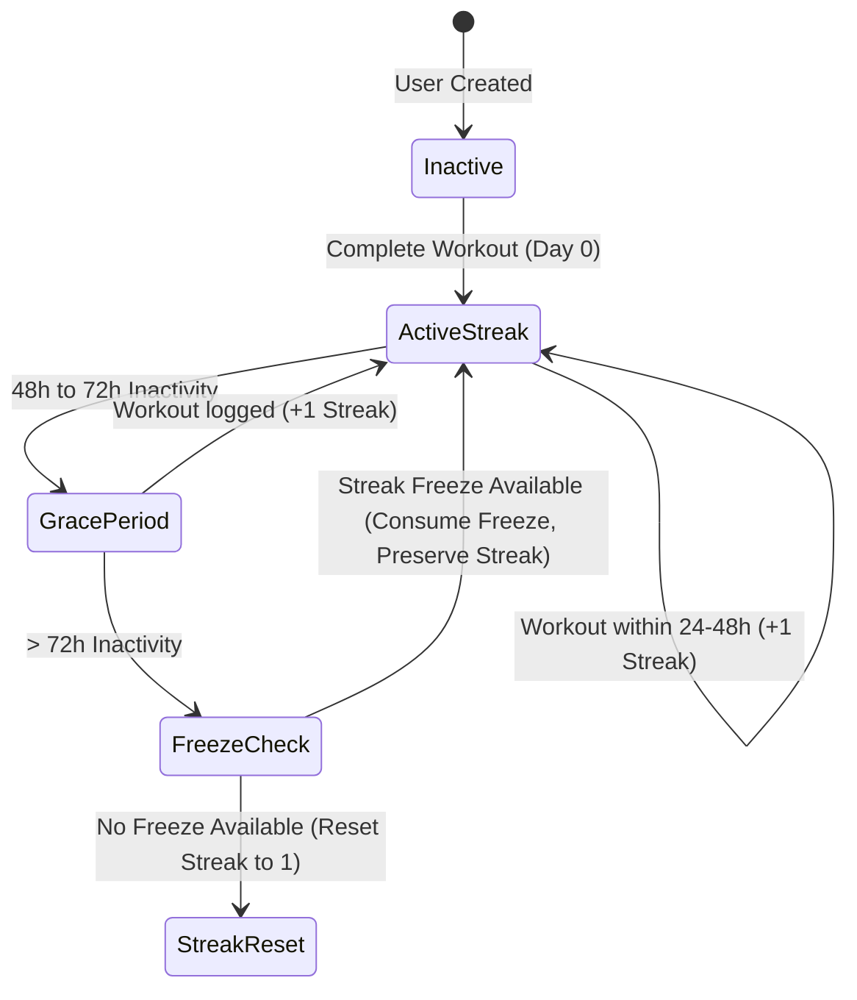

# OmniFit - Intelligent Fitness & Nutrition Platform 🏋️‍♂️🤖

> **A Context-Aware, Gamified, and Local-First Fitness Architecture**  
> *BSc Final Year Dissertation Project & Technical Showcase*

[](https://nodejs.org/)
[](https://react.dev/)
[](https://www.sqlite.org/)
[](https://ai.google.dev/)
[](https://github.com/)
[](LICENSE)

---

## 📌 Executive Summary & Dissertation Motivation

A persistent challenge in modern digital health technologies is **user retention and adherence attrition**: over 70% of fitness tracking app users abandon logging within their first 30 days. Research identifies three root causes:
1. **High Logging Friction & Latency**: Multi-step navigation and cloud-synchronization delays during workouts induce high cognitive load.
2. **Rigid, Unadaptive Routines**: Pre-configured static routines fail when gym equipment is occupied, users experience acute fatigue, or require demographic-aware adjustments (e.g., joint-friendly adaptations for elevated BMI or master athletes).
3. **Punishing Behavioral Mechanics**: Traditional binary streak systems punish minor schedule interruptions with total progress resets (the "all-or-nothing" streak penalty), inducing demotivation and abandonment.

**OmniFit** was architected to solve these challenges through a tri-part technical design:
1. **Context-Aware AI Coaching Engine**: Powered by Google Gemini 1.5 with recursive function calling and safety heuristics.
2. **Adaptive Behavioral Gamification**: Non-punitive 72-hour grace periods, consumable streak freezes, dynamic XP volume scaling, and automated 1RM Personal Record (PR) detection.
3. **Local-First, Sync-As-You-Go Architecture**: Zero-latency SQLite persistence on every set logged with crash-recovery integrity.

---

## 🏛️ System Architecture



---

## 🧠 Core Engineering Highlights

### 1. Context-Aware AI Coaching & Tool Calling
- **Safety-First Demographic Adaptations**:
  - Automatically assesses user **Age** and **BMI** to enforce exercise safety constraints (e.g. prioritizing machine-supported stabilizers and warm-up tempos for $\text{BMI} > 30$ and master athletes $\text{Age} > 50$).
- **Live Workout Adaptations**:
  - Supports real-time substitution recommendations when gym equipment is taken or broken, mapping target muscle activation to alternative movements.
- **Recursive Function Calling**:
  - Implements Google Gemini function declarations: `recommend_split`, `search_exercises`, `list_exercises_by_muscle`, and `suggest_exercises`.
- **Zero-Friction Demo Mode**:
  - Built-in deterministic mock fallback ensures employers, reviewers, and CI environments without a live `GEMINI_API_KEY` can experience full coaching and routine generation workflows immediately.

### 2. Algorithmic Gamification & PR Math
- **Dynamic XP Volume Curve**:
  $$\text{Session XP} = \left\lfloor \frac{\text{Volume (kg)}}{3} + (\text{Completed Sets} \times 50) + \text{PR Bonuses} \right\rfloor$$
- **Level Scaling**:
  $$\text{Level} = \left\lfloor \frac{\text{Total XP}}{50000} \right\rfloor + 1$$
- **1RM Epley Estimation Formula**:
  $$\text{Estimated 1RM} = \text{Weight} \times \left(1 + \frac{\text{Reps}}{30}\right)$$
- **Reward Revocation Protection**:
  - If a user modifies or deletes a completed set during or after a session, the XP and PR ledger recalculates immediately to prevent exploitative reward loops.

### 3. Non-Punitive 72-Hour Streak State Machine



---

## 🧪 Test Suite & Empirical Proof

The codebase contains a comprehensive automated test suite covering unit math, state recovery, and live API workflows:

| Test Suite | File | Focus Area | Status |
| :--- | :--- | :--- | :--- |
| **Gamification Math** | [`backend/tests/unit/gamification.test.js`](file:///C:/Users/coryj/dissertation_public/backend/tests/unit/gamification.test.js) | XP scaling, Level thresholds, Progress % | ✅ 8/8 Passed |
| **PR Detection Engine** | [`backend/tests/unit/records.test.js`](file:///C:/Users/coryj/dissertation_public/backend/tests/unit/records.test.js) | Epley formula 1RM, inferior rejection, PR revocation | ✅ 4/4 Passed |
| **Streak State Machine** | [`backend/tests/integration/streak.test.js`](file:///C:/Users/coryj/dissertation_public/backend/tests/integration/streak.test.js) | Time travel simulation, freeze consumption, resets | ✅ Passed |
| **Dashboard Analytics API** | [`backend/tests/integration/dashboard_api.test.js`](file:///C:/Users/coryj/dissertation_public/backend/tests/integration/dashboard_api.test.js) | Profile updates, weekly frequency, volume by muscle | ✅ Passed |
| **Routine Builder Flow** | [`backend/tests/integration/routine_builder.test.js`](file:///C:/Users/coryj/dissertation_public/backend/tests/integration/routine_builder.test.js) | Routine CRUD, exercise ordering, set configurations | ✅ Passed |
| **Live Workout Flow** | [`backend/tests/integration/live_workout_flow.test.js`](file:///C:/Users/coryj/dissertation_public/backend/tests/integration/live_workout_flow.test.js) | Sync-as-you-go, PR triggers, Victory Lap XP calculation | ✅ Passed |
| **Sync-As-You-Go** | [`backend/tests/integration/sync.test.js`](file:///C:/Users/coryj/dissertation_public/backend/tests/integration/sync.test.js) | Atomic set persistence without full finalization | ✅ Passed |

---

## ⚡ Quickstart & Local Setup

### Prerequisites
- [Node.js](https://nodejs.org/) (v18.0+ or v20.0+ recommended)
- [npm](https://www.npmjs.com/)

---

### 🚀 1-Step Root Setup

Install dependencies across both backend and frontend from the project root:

```bash
npm run install:all
```

---

### 🖥️ Running the Application

#### Option A: Running with Full Live Gemini AI (Recommended)
1. Navigate to `backend` and create your environment configuration:
   ```bash
   cp backend/.env.example backend/.env
   ```
2. Insert your Google Gemini API Key in `backend/.env`:
   ```ini
   PORT=3000
   DB_PATH=./database.sqlite
   GEMINI_API_KEY=your_gemini_api_key_here
   PRIMARY_MODEL=gemini-1.5-flash-latest
   FALLBACK_MODEL=gemini-1.5-pro-latest
   ```
3. Start the backend:
   ```bash
   npm run dev:backend
   ```
4. In a separate terminal, start the frontend:
   ```bash
   npm run dev:frontend
   ```

#### Option B: Running in Demo Mode (No API Key Required)
*No `.env` configuration needed!* The backend automatically boots in **Demo Mode**, utilizing deterministic coaching heuristics for training split generation and exercise adaptations.

1. Start Backend: `npm run dev:backend` (runs on `http://localhost:3000`)
2. Start Frontend: `npm run dev:frontend` (runs on `http://localhost:5173`)

---

### 🧪 Running the Tests

To run the complete automated test suite:

```bash
# 1. Start the backend server in one terminal
npm run dev:backend

# 2. Run unit and integration test suites in another terminal
npm test
```

To run offline unit tests only (no server required):
```bash
npm run test:unit
```

---

## 📂 Repository Structure

```text
.
├── backend/
│   ├── database.js               # SQLite database connection, schema migration & seed data
│   ├── server.js                 # Express REST API, Gemini AI tool-calling & fallback engine
│   ├── scripts/                  # Developer utilities (model query, persona validation)
│   │   ├── list-models.js
│   │   ├── test-ai-personas.js
│   │   └── test-gemini.js
│   ├── tests/
│   │   ├── integration/          # Live workout, streak state machine, sync & dashboard tests
│   │   └── unit/                 # Mathematical XP formulas & Epley 1RM PR unit tests
│   ├── .env.example              # Example environment template
│   └── package.json
├── frontend/
│   ├── src/
│   │   ├── assets/               # Visual brand assets & hero graphics
│   │   ├── components/
│   │   │   ├── App/              # Root layout & AI Coach side-drawer panel
│   │   │   ├── Dashboard/        # Level progression, streak status & Recharts analytics
│   │   │   ├── History/          # Workout logs & detailed set breakdown views
│   │   │   ├── LiveWorkout/      # Real-time workout tracker, set timer & Victory Lap modal
│   │   │   └── RoutineBuilder/   # Drag-and-drop routine editor & exercise explorer
│   │   ├── services/
│   │   │   └── api.js            # Unified frontend API client & error boundaries
│   │   ├── index.css             # OmniFit dark theme design tokens
│   │   ├── main.jsx
│   │   └── App.jsx
│   ├── index.html
│   ├── vite.config.js
│   └── package.json
├── package.json                  # Root multi-package script runner
├── .gitignore
├── LICENSE
└── README.md
```

---

## 🛠️ Technology Stack

- **Frontend**: React 19, Vite, Recharts, React Router v7, Vanilla CSS Tokens
- **Backend**: Node.js, Express, SQLite3, SQLite Promise Wrapper
- **AI & LLM**: Google Gemini 1.5 Flash / Pro (`@google/generative-ai`)
- **Testing**: Node.js Native Test Harness & Assertion Engine

---

## 👨‍💻 Author & Academic Context

- **Author**: Cory Weller
- **Project**: BSc Computer Science Final Year Dissertation
- **Keywords**: *Human-Computer Interaction (HCI), Large Language Models (LLMs), Behavioral Gamification, Local-First Software, Digital Health Adherence*

---

## 📄 License

This repository is licensed under the [MIT License](LICENSE).
